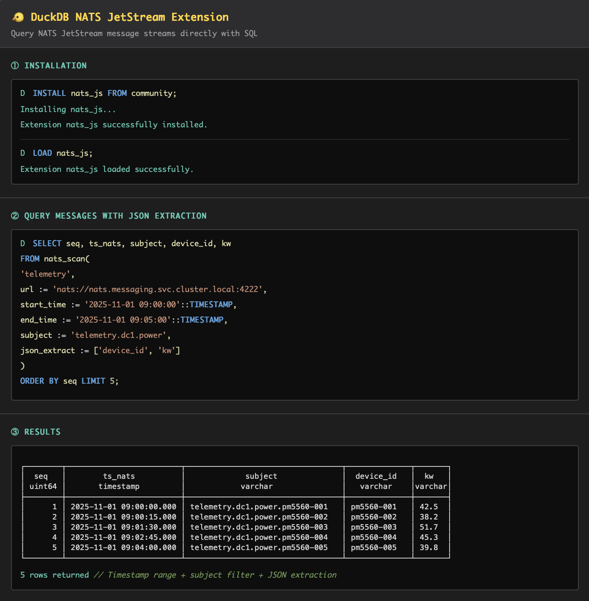

# DuckDB NATS JetStream Extension

[](https://github.com/brannn/duckdb-nats-jetstream/actions/workflows/MainDistributionPipeline.yml)
[](https://github.com/brannn/duckdb-nats-jetstream/releases/tag/v0.1.0)
[](https://github.com/duckdb/duckdb/releases/tag/v1.4.1)
[](LICENSE)
[](https://github.com/brannn/duckdb-nats-jetstream/actions)

Query NATS JetStream message streams directly with SQL. Timestamp-based range queries, subject filtering, and native type support for JSON and Protocol Buffers payloads.

---

## JSON Payload Extraction



## Protocol Buffers with Native Types


---

## Quick Start

```sql
-- Install from DuckDB Community Extensions
INSTALL nats_js FROM community;
LOAD nats_js;

-- Query messages with timestamp range and subject filtering
SELECT seq, ts_nats, subject, device_id, kw
FROM nats_scan(
    'telemetry',
    url := 'nats://nats.messaging.svc.cluster.local:4222',
    start_time := '2025-11-01 09:00:00'::TIMESTAMP,
    end_time := '2025-11-01 09:05:00'::TIMESTAMP,
    subject := 'telemetry.dc1.power',
    json_extract := ['device_id', 'kw']
)
ORDER BY seq;
```

---

## Key Features

- **Timestamp-based queries** - Binary search through message streams by time range
- **Subject filtering** - Filter messages by NATS subject patterns
- **JSON extraction** - Extract JSON fields as columns
- **Protocol Buffers** - Native type support (VARCHAR, DOUBLE, BOOLEAN, INTEGER, etc.)
- **Nested fields** - Access nested protobuf fields with dot notation
- **Sequence ranges** - Query by message sequence numbers
- **Multi-platform** - Linux, macOS, Windows, WebAssembly

---

## Documentation

- **[Examples](docs/EXAMPLES.md)** - Practical examples for common use cases
- **[Full Guide](docs/GUIDE.md)** - Complete documentation including installation, query patterns, and Protocol Buffers integration
- Performance considerations
- API reference

---

## License

MIT License - see [LICENSE](LICENSE) file for details.
